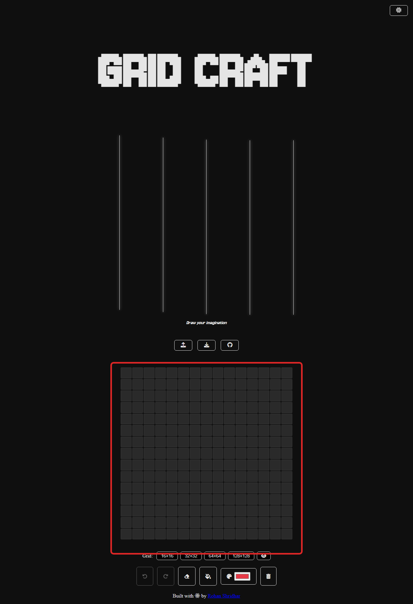
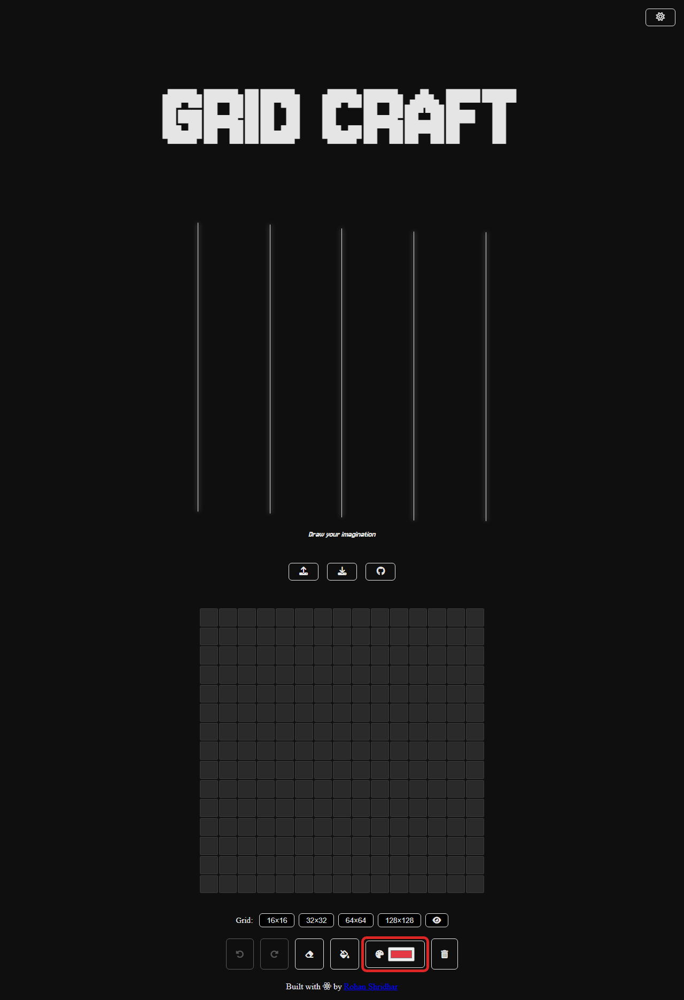
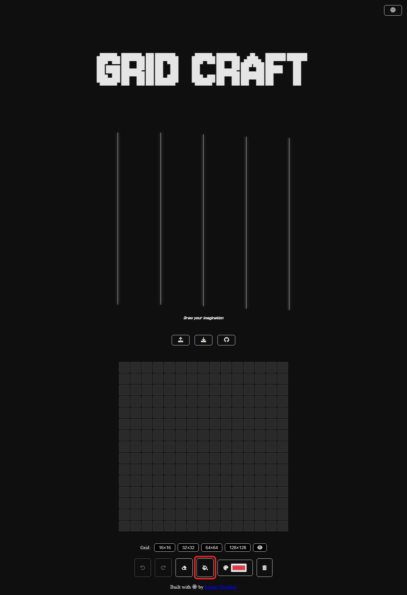
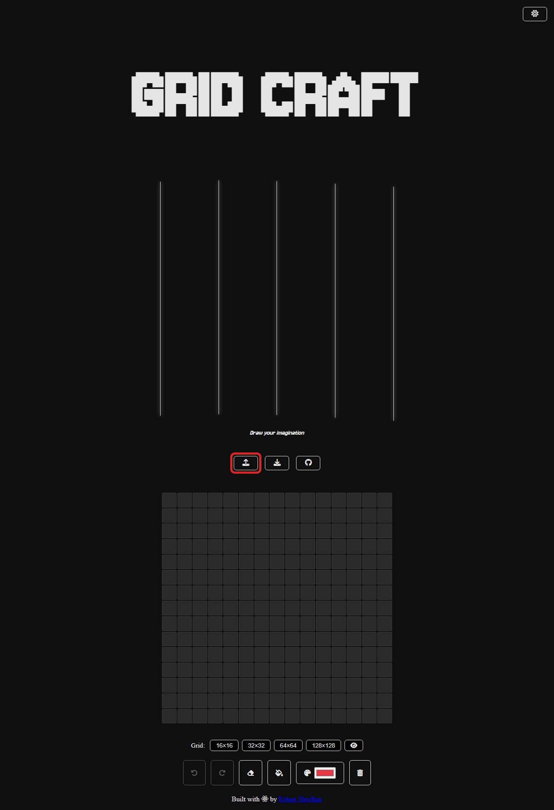

# GridCraft Manual

This manual explains the basic workflow for creating a canvas in GridCraft.
The red rectangles in the screenshots mark the tool or area used in each step.

## 1. Open GridCraft

Open the live app:

https://rohan-shridhar.github.io/gridcraft/

You can also run it locally by opening `index.html` in a browser.

## 2. Use the Drawing Canvas

The canvas is the square grid in the center of the page. Click or drag across
cells to paint pixels with the selected color.

## 3. Choose a Color

Use the color picker in the bottom toolbar to choose the paint color. After
selecting a new color, click or drag on the canvas to draw with it.

## 4. Fill an Area

Use the fill tool to paint connected cells of the same color in one action.

1. Select a color with the color picker.
2. Click the fill tool.
3. Click a cell on the canvas.

## 5. Adjust the Canvas Grid

Use the grid size buttons below the canvas to switch between available canvas
sizes. Changing the grid size clears the current drawing, so export your work
first if you want to keep it.

Available sizes:

| Size | Best for |
| --- | --- |
| 16x16 | Simple icons and small pixel art |
| 32x32 | More detailed icons |
| 64x64 | Detailed pixel art |
| 128x128 | Large drawings |

The eye button toggles preview mode. Preview hides grid lines and disables
drawing tools so you can inspect the artwork cleanly.

## 6. Edit Your Drawing

Use the toolbar actions while the grid is visible:

| Tool | Use |
| --- | --- |
| Undo | Revert the last drawing action |
| Redo | Restore an undone action |
| Eraser | Paint cells back to the default canvas color |
| Fill | Fill connected cells with the selected color |
| Color picker | Choose the active paint color |
| Clear | Reset the whole canvas |

Keyboard shortcuts:

| Action | Shortcut |
| --- | --- |
| Undo | `Ctrl + Z` |
| Redo | `Ctrl + Y` |
| Eraser | `E` |
| Fill tool | `B` |
| Color picker / paint brush | `A` |
| Clear canvas | `C` |

## 7. Export the Canvas

Click the export button at the top of the app to download your canvas as a PNG
image.

## 8. Import an Image

Click the import button beside the export button to load an image into the
current grid. GridCraft converts the image into pixel cells using the current
canvas size.

## Quick Workflow

1. Open GridCraft.
2. Choose a grid size.
3. Pick a color.
4. Draw on the canvas.
5. Use fill, eraser, undo, or redo as needed.
6. Preview the result with the eye button.
7. Export the final canvas as a PNG.
