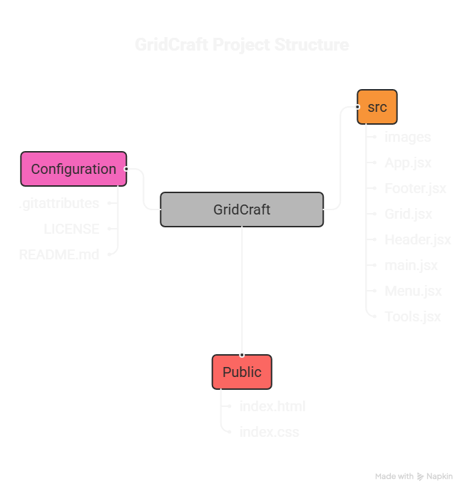

# GridCraft 🎨

A React-powered pixel art tool that lets you paint on a 15x15 grid with the full RGB color spectrum.

## Why GridCraft? 🎯

Built with React, GridCraft demonstrates how modern component-based architecture can create interactive, stateful applications without complexity. It's a lightweight, accessible alternative to heavy art software that showcases clean React patterns and efficient state management.

## Features ✨

- **14x14 Drawing Grid** - A perfectly sized canvas for pixel art and simple designs
- **Full RGB Color Support** - Choose any color using an intuitive RGB color picker
- **Export as PNG** - Download your creations to save and share
- **Right-Click to Draw** - Intuitive drawing mechanism using right mouse button
- **Color Selection** - Easily select and switch between different colors
- **Undo/Redo** - Never lose your work with full undo/redo support
- **Erase Mode** - Quickly correct mistakes with the eraser tool
- **Clear Canvas** - Start fresh with a single click
- **Real-time Updates** - See your changes instantly as you draw


## Live Demo 🚀

Experience GridCraft here: **[GridCraft Live](https://rohan-shridhar.github.io/gridcraft/)**


## Repository Structure 📁
```txt
gridcraft/
├── src/                    # Source files (transpiled in-browser by Babel)
│   ├──images/              # Images used for background, icon etc..   
│   ├── App.jsx             # Root component - state management & download logic
│   ├── Footer.jsx          # Footer component with links/info
│   ├── Grid.jsx            # Grid rendering and cell logic
│   ├── Header.jsx          # Header component
│   ├── main.jsx            # Entry point (creates root, renders App)
│   ├── Menu.jsx            # Menu component
│   └── Tools.jsx           # Drawing tools component (pen, eraser, clear)
├── .gitattributes          # Git configuration
├── index.html              # Main HTML - loads React, Babel, html2canvas, components
├── index.css               # Global styles and grid layout
├── LICENSE                 # License file
└── README.md               # Documentation
````

## Technical Implementation 🔧

- **React 18 (CDN)** - Loaded via unpkg, no build step required
- **In-Browser JSX Transpilation** - Babel Standalone converts JSX syntax to JavaScript at runtime
- **Component Architecture** - Modular design with seven specialized components:
  - `App.jsx` - Root component managing core state and download logic
  - `Grid.jsx` - Renders 14x14 grid and handles cell painting
  - `Tools.jsx` - Drawing tools (color picker, eraser, undo/redo, clear)
  - `Menu.jsx` - Download button and high-level controls
  - `Header.jsx` & `Footer.jsx` - Layout components
  - `main.jsx` - React entry point with `createRoot`
- **State Management** - React hooks for grid state, color selection, and undo/redo history
- **PNG Export System** - Multi-step process for high-quality exports:
  1. Temporarily removes grid borders and gaps for clean output
  2. Uses **html2canvas** with `scale: 8` for high-resolution captures
  3. Maintains transparent background with `backgroundColor: null`
  4. Restores original styling after capture
  5. Triggers download via dynamically created anchor tag
- **Undo/Redo System** - History tracking with `past`, `present`, `future` state pattern
- **Event Handling** - Mouse event listeners for right-click drawing
- **Props Communication** - Download function passed from App to Menu (`<Menu downloadImage={downloadImage} />`)


## How to Contribute 

Checkout [CONTRIBUTING.md](CONTRIBUTING.md) for instructions.

## Contributors

Thanks to these amazing people who contributed ❤️

<a href="https://github.com/rohan-shridhar/gridcraft/graphs/contributors">
  
</a>


## Guidelines

- Keep pull requests focused on a single feature or fix
- Test your changes locally before submitting
- Update documentation if your changes affect usage
- Be respectful and constructive in discussions
- If adding a new feature, consider adding a brief explanation of why it's useful

## License 📄

This project is licensed under the MIT License - see the [LICENSE](LICENSE) file for details.
