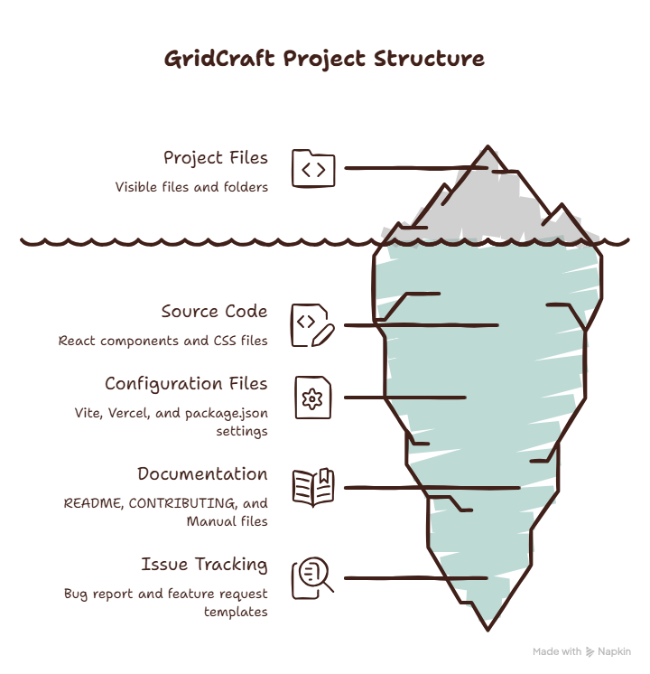

# GridCraft 🎨


A React-powered pixel art tool that lets you paint on a customizable grid (16×16, 32×32, 64×64, or 128×128) with the full RGB color spectrum.

## Why GridCraft? 🎯

Built with React, GridCraft demonstrates how modern component-based architecture can create interactive, stateful applications without complexity. It's a lightweight, accessible alternative to heavy art software that showcases clean React patterns and efficient state management.

## Features ✨

- **Multiple Grid Sizes** - Draw on a 16×16, 32×32, 64×64, or 128×128 canvas depending on your project
- **Full RGB Color Support** - Choose any color using an intuitive RGB color picker
- **Export as PNG** - Download your creations to save and share
- **Right-Click to Draw** - Intuitive drawing mechanism using right mouse button
- **Color Selection** - Easily select and switch between different colors
- **Undo/Redo** - Never lose your work with full undo/redo support
- **Erase Mode** - Quickly correct mistakes with the eraser tool
- **Clear Canvas** - Start fresh with a single click
- **Real-time Updates** - See your changes instantly as you draw

## Keyboard Shortcuts

Shortcuts work while the drawing grid is visible:

| Action | Shortcut |
| --- | --- |
| Undo | `Ctrl + Z` |
| Redo | `Ctrl + Y` |
| Paint brush | `A` |
| Fill enclosed cells | `B` |
| Fill transparent cells|`C`|
| Clear canvas | `D` |
| Eraser | `E` |


## Live Demo 🚀

Experience GridCraft here: **[GridCraft Live](https://gridcraft-by-me.vercel.app/)**

## User Manual

Need step-by-step usage instructions? Read the [GridCraft Manual](Manual.md).


## Repository Structure 📁
```txt
rohan-shridhar-gridcraft/
├── README.md                               # Project overview and usage documentation
├── CODE_OF_CONDUCT.md                      # Community code of conduct
├── CONTRIBUTING.md                          # Contribution guidelines
├── google53f3f4f7aefc7ea4.html             # Verification file for Google indexing
├── index.html                              # Main HTML entry point for the app
├── LICENSE                                 # MIT license details
├── Manual.md                               # Step-by-step user guide
├── package.json                            # Project scripts and dependencies
├── vercel.json                             # Vercel deployment configuration
├── vite.config.js                          # Vite configuration for local dev/build
├── public/                                 # Static public assets
│   └── fonts/                              # Custom font files
│       └── Minecraft.otf                  # Game-like font used in the UI
├── src/                                    # Application source code
│   ├── App.jsx                             # Main app state management and UI composition
│   ├── Contributors.jsx                    # Contributors section component
│   ├── ErrorPage.jsx                       # Error page fallback component
│   ├── Footer.jsx                          # Footer content and links
│   ├── Grid.jsx                            # Pixel grid rendering and drawing logic
│   ├── Header.jsx                          # Header/navigation component
│   ├── index.css                           # Global styles and layout
│   ├── main.jsx                            # React app entry point
│   ├── Menu.jsx                            # Toolbar/menu controls
│   ├── toastMessages.js                    # Toast notifications for user feedback
│   └── Tools.jsx                           # Drawing tools and controls
└── .github/                                # GitHub project metadata
    └── ISSUE_TEMPLATE/                     # Issue templates for bug reports and features
        ├── bug_report.md                   # Bug report issue template
        └── feature_request.md              # Feature request issue template
```



## Technical Implementation 🔧

- **React 18 (CDN)** - Loaded via unpkg, no build step required
- **In-Browser JSX Transpilation** - Babel Standalone converts JSX syntax to JavaScript at runtime
- **Component Architecture** - Modular design with seven specialized components:
  - `App.jsx` - Root component managing core state and download logic
  - `Grid.jsx` - Renders the drawing grid (16×16 up to 128×128) and handles cell painting
  - `Tools.jsx` - Drawing tools (color picker, eraser, undo/redo, clear)
  - `Menu.jsx` - Download button and high-level controls
  - `Header.jsx` & `Footer.jsx` - Layout components
  - `main.jsx` - React entry point with `createRoot`
- **State Management** - React hooks for grid state, color selection, and undo/redo history
- **PNG Export System** - Multi-step process for high-quality exports:
  1. Temporarily removes grid borders and gaps for clean output
  2. Uses **html2canvas** with `scale: 8` for high-resolution captures
  3. Maintains transparent background with `backgroundColor: null`
  4. Restores original styling after capture
  5. Triggers download via dynamically created anchor tag
- **Undo/Redo System** - History tracking with `past`, `present`, `future` state pattern
- **Event Handling** - Mouse event listeners for right-click drawing
- **Props Communication** - Download function passed from App to Menu (`<Menu downloadImage={downloadImage} />`)


## How to Contribute 

Checkout [CONTRIBUTING.md](CONTRIBUTING.md) for instructions.

## Contributors

Thanks to these amazing people who contributed ❤️

<a href="https://github.com/rohan-shridhar/gridcraft/graphs/contributors">
  
</a>


## Guidelines

- Keep pull requests focused on a single feature or fix
- Test your changes locally before submitting
- Update documentation if your changes affect usage
- Be respectful and constructive in discussions
- If adding a new feature, consider adding a brief explanation of why it's useful

## License 📄

This project is licensed under the MIT License - see the [LICENSE](LICENSE) file for details.
